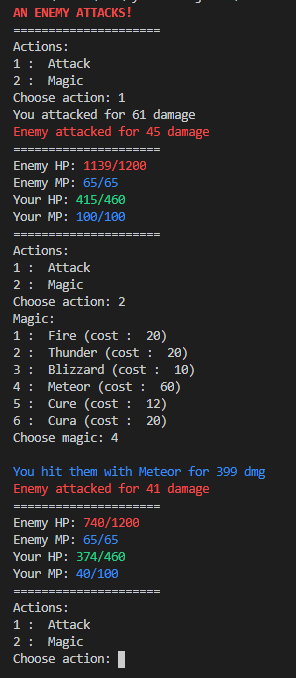

# RPG
This is a basic practice python text based game that simulates the battle phases of a typical RPG. 

There is a player character as well as an enemy each with their own stats ranging from atk and hp to a fully fledged magic system complete with a variety of spells and effects. Through this text based battle, users can pit themselves against a powerful enemy using their attacks and spells strategically in order to combat their foe. There is also a pseduo random element in order to promote replayability and engagement during combat.

This currently only simulates one battle and was used to fortify my recent found learning of python. In the future, more characters could be added to battles as well as progression between multiple battles could be added.

