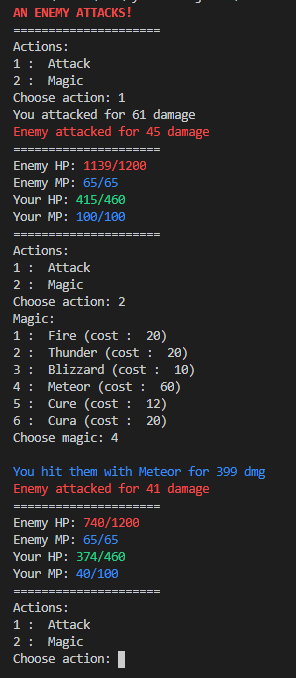

# RPG
Basic practice python game that simulates the battle phases of a typical RPG. There is a player character as well as an enemy each with their own stats ranging from atk and hp to a fully fledged magic system complete with a variety of spells and effects. This currently only simulates one battle and was used to fortify my recent found learning of python.

